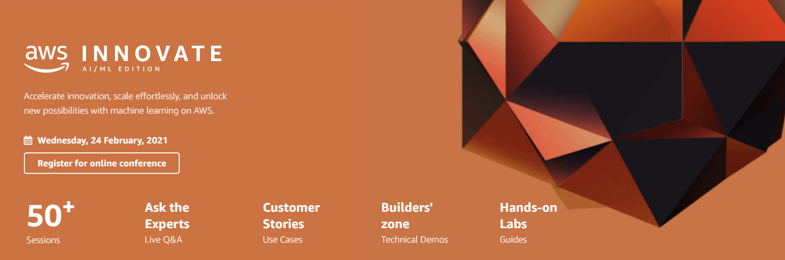

  

The following labs will give you hands-on experience with a number of the topics discussed during the AWS Innovate AI/ML Edition.

ℹ️ **You will run these lab in your own AWS account. Please follow directions at the end of the labs to remove resources to minimize costs.**

These labs will remain available after AWS Innovate AI/ML Edition. **You can do them at any time**, even after AWS Innovate AI/ML Edition.

## [Customer Churn Prediction](http://bit.ly/35OfP4e)

This lab describes using machine learning (ML) for the automated identification of unhappy customers, also known as customer churn prediction

Duration: Approximately 60 - 90 minutes

[View lab instructions](http://bit.ly/35OfP4e)

## [Virtual Contact Center](https://github.com/phonghuule/connect-lex-integration-bookappointment)

In this lab, you will be building a contact center using Amazon Connect and integrating with Amazon Lex.

Duration: Approximately 60 minutes

[View lab instructions](https://github.com/phonghuule/connect-lex-integration-bookappointment)

## [Sentiment Analysis Web App](https://github.com/rahulbaisla/sentimentAnalysisLab)

In this lab, we will demonstrate how to add the AI and ML cloud service feature to your web application with React and the Amplify Framework.

Duration: Approximately 30 minutes

[View lab instructions](https://github.com/rahulbaisla/sentimentAnalysisLab)

## [Personalized Recommendations](https://github.com/tsengsy/aws-labs/blob/master/personalise/personalise.md)

In this lab you will learn the basics of how to use Amazon Personalize in order to create a recommendation system. Be aware that the data upload and training steps do take a long period to perform.

Duration: Approximately 60 - 90 minutes

[View lab instructions](https://github.com/tsengsy/aws-labs/blob/master/personalise/personalise.md)

## [AWS Deep Racer Workshop](https://github.com/phonghuule/aws-deepracer-workshops/)

Get ready to race by building your own AWS DeepRacer reinforcement learning (RL) model. AWS DeepRacer is an integrated learning system for users of all levels that allows you to explore RL and experiment with building autonomous driving applications. In this lab, you get hands-on with creating, training, and tuning your RL model.

Duration: 90 minutes

[View lab instructions](https://github.com/phonghuule/aws-deepracer-workshops/)

## [Build, train & debug, and deploy & monitor with Amazon SageMaker](https://github.com/phonghuule/reinvent2019-aim362-sagemaker-debugger-model-monitor)

In this lab, we show the different aspects of the machine learning (ML) workflow for building, training, and deploying a model using all the capabilities of Amazon SageMaker. We also discuss how Amazon SageMaker removes the heavy lifting from each step of the ML workflow. Come learn how to build, train, debug, monitor, and deploy your ML models. 

Duration: 180 minutes

[View lab instructions](https://github.com/phonghuule/reinvent2019-aim362-sagemaker-debugger-model-monitor)

## [Text Extraction and Analysis Using Amazon Textract and Amazon Comprehend](https://github.com/bikrambora/nlp-lab)

In this lab we will extract the features of a text document using Amazon Textract. Then use Amazon Comprehend to analyse the extracted features. We will learn how to connect aws services together using AWS Lambda.

Duration: 180 minutes

[View lab instructions](https://github.com/bikrambora/nlp-lab)

## [Reviewing your code with Amazon CodeGuru Reviewer](https://github.com/phonghuule/amazon-codeguru-reviewer-sample-app)

In this lab, we will walk you through how to associate Amazon CodeGuru with your repo and automate code review by using Amazon CodeGuru Reviewer

Duration: 60 minutes

[View lab instructions](https://github.com/phonghuule/amazon-codeguru-reviewer-sample-app)

## [Enterprise Search with Amazon Kendra](https://github.com/phonghuule/enterprise-search-with-amazon-kendra-workshop)

In this lab, we will be using Amazon Kendra to setup our own Enterprise Search instance, index HTML/PDF content in Amazon S3, and use a variety of query types to return accurate search results for end users.

Duration: 90 minutes

[View lab instructions](https://github.com/phonghuule/enterprise-search-with-amazon-kendra-workshop)